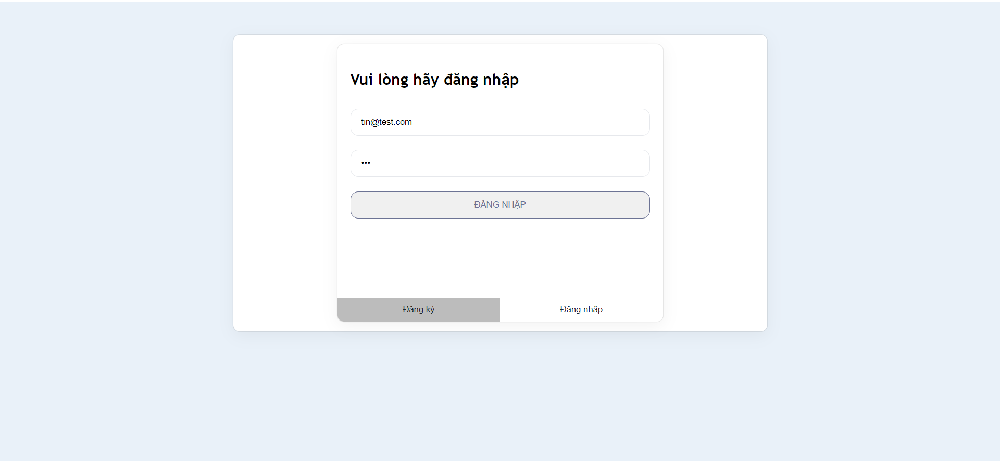
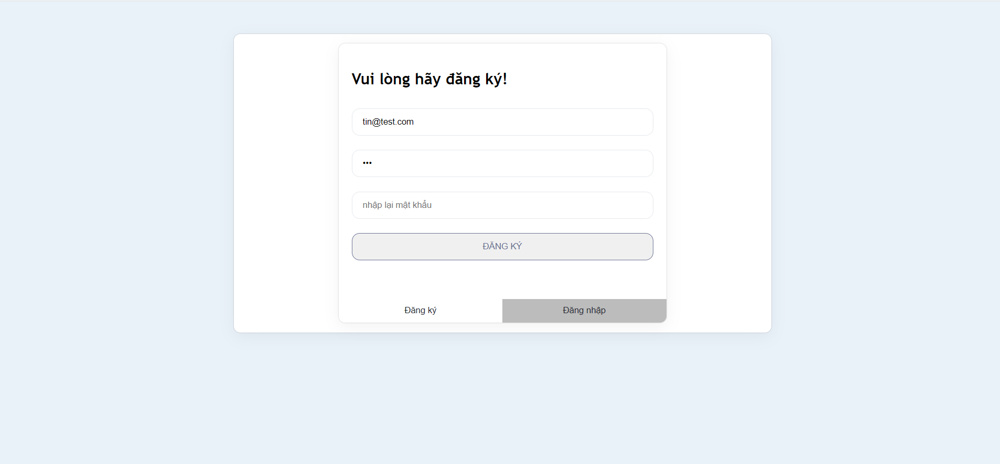
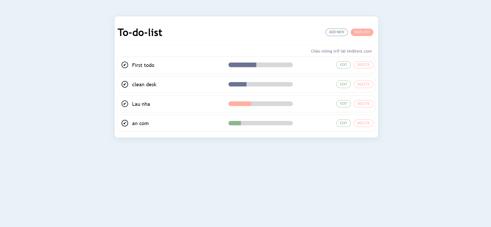
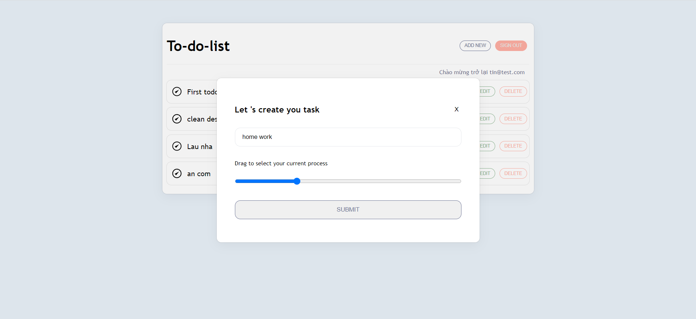
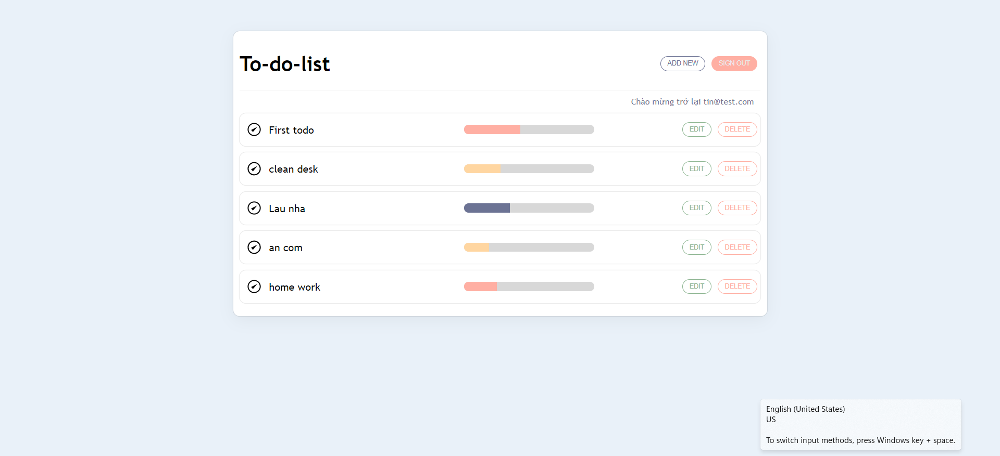
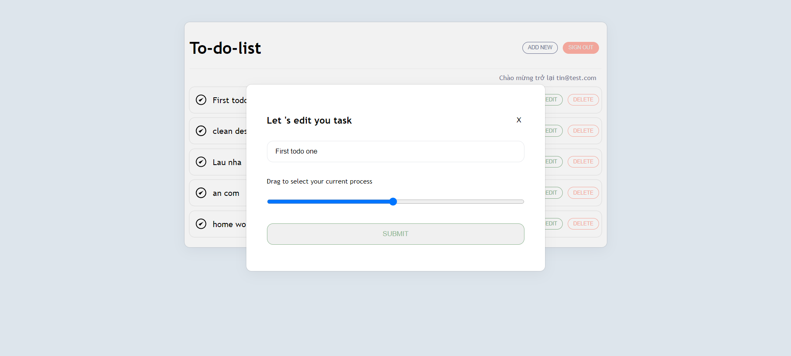
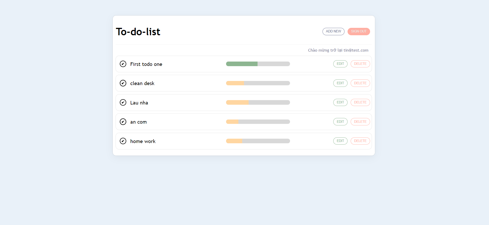
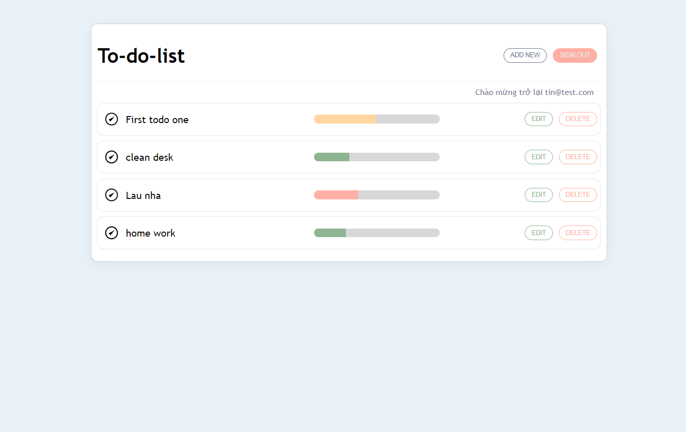

# Assignment Title: To- Do- App

## Assignment Description:

In this assignment, you will create a basic React.js. You'll apply key React/Next concepts and fundamental web development skills. Your task is to develop a one- page web application named "To- do- app" that allows users to Add, delete, edit a job.

## Instructions:

1. Fork the provided project repository to your profile and clone it to your machine to begin the project.
2. Design and implement a web application named "To- do- app" that allows users to Add, delete, edit a job.
3. The application should have the following pages:
 -  Home Page:Display the login registration home page
 -  Main page:Display to do app

## Requirements:

-  Use React.js to create the web application.
-  Use  pool query  for fetching and caching the api data.
-  Write clean, maintainable, and well- documented code.
-  Use Git for version control, committing your code regularly to the forked Git repository in your profile.
-  Deploy the application to a hosting platform (e.g., Vercel, Netlify) and provide a live demo URL in your repo and the submission form.

### Technology used

- Font-end: HTML, CSS, Javascript, Reactjs
- Back-end: Nodejs, Expressjs
- Database: Postgresql

### Function Description:
- Use client and server model.
- Send and receive data via rest api.
- Create an option to register and login if selecting the register button will display the password verification line.
- Register and Login use cookies to display the main page.
- Check the encrypted account and password.
- Passwords are encrypted and saved with cookies.
- Main page: Add, Delete, Edit notes by user account.
- The Add and Edit window builds on one interface.
- Logout function clears cookies and displays the login page again. 

# Getting Started with Create React App
Clone git repository
### `https://github.com/tin2000/to- do- App.git`
And in the project directory, you can run:
### `npm install`
### `cd client`
### `npm start`
### `cd server`
### `npm start`

Runs the app in the development mode.
Open [http://localhost:3000](http://localhost:3000) to view it in your browser.
Open [http://localhost:8080](http://localhost:8080) to view it in your browser.

The page will reload when you make changes.

You may also see any lint errors in the console.

**Hurray, Your app is now running on port 3000 in your browser**
**Hurray, Your api is now running on port 8080 in your browser**

## Screenshots

### Landing Page

### Register 

on click login it shows main page
### Main page

### Add Task

### Add Task Sucess

### Edit Task

### Edit Task success

### Delete Task

If you click SIGN OUT, you will return to the login page
### Return Login page

## Contact
Nguyen Tin - dangtinanother@gmail.com

Project Link: [https://github.com/tin2000/to- do- App](https://github.com/tin2000/to- do- App)

### Thank You 